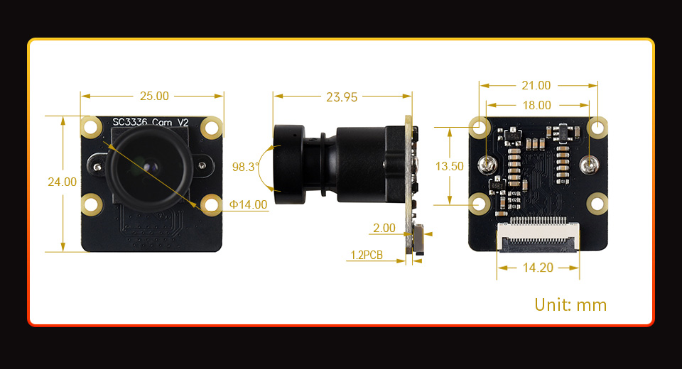

# luckfox-pico-webcam

**A £12 board that shows up on your PC as a 1080p webcam. No drivers, no vendor software, no cloud.**

[](https://github.com/ashbmstu/luckfox-pico-webcam/actions/workflows/ci.yml)
[](LICENSE)


This turns a [Luckfox Pico Mini B](https://www.luckfox.com/Luckfox-Pico-Mini-B)
and an SC3336 camera module into a standard USB Video Class device. Plug it into
Windows, macOS or Linux and it is simply a camera — Zoom, OBS, Teams and the
system camera app all see it with no software installed on the host.

Everything from the sensor to the JPEG encoder runs inside the SoC's hardware
pipeline. The CPU is nearly idle while streaming.

<p align="center">
  
</p>

## What you get

| | |
|---|---|
| **Resolutions** | 640×360, 1280×720, 1920×1080, 2304×1296 — all 16:9 |
| **Frame rate** | 25 fps at every resolution, hardware-encoded MJPEG |
| **Measured** | 25.0 fps sustained at **every** resolution, **0 timeouts**, host and board agreeing on the negotiated size |
| **Bitrate** | About 27 Mbit/s at 1080p and 32 Mbit/s at 2304×1296 on a normally lit scene, against a USB isochronous budget of roughly 65 Mbit/s. MJPEG is scene-dependent: a dark or flat scene compresses to well under half of that |
| **Host support** | Any UVC host. Verified on Windows through both Media Foundation and DirectShow |
| **Field of view** | 98.3° diagonal — the same at every resolution; not croppable |
| **CPU load while streaming** | The daemon uses ~2% of one core at 1080p25 — encoding never enters userspace. The 3A server is the busiest part of the stack at ~7% |

## What it costs

| Part | Approx. |
|------|--------|
| Luckfox Pico Mini B (RV1103, 64 MB DDR2, 128 MB NAND) | ~£8 |
| SC3336 3 MP camera module (MIPI CSI) | ~£4 |
| USB-C **data** cable | you have one |

No soldering. The camera module plugs into the board's MIPI connector.

## Quick start

You need the board flashed with the Luckfox Buildroot image, `adb` on your PC,
and a cross-compiler. Full detail is in [docs/building.md](docs/building.md) and
[docs/installing.md](docs/installing.md); the short version:

```bash
# 1. Build (needs the Luckfox Pico SDK; see docs/building.md)
cd src/streamer && make SDK=/path/to/luckfox-pico
```

```bash
# 2. Deploy. Never killall the daemon - see below.
adb push uvc_streamer /tmp/uvc_streamer
adb shell "chmod +x /tmp/uvc_streamer && mv /tmp/uvc_streamer /oem/uvc_streamer"
adb shell reboot
```

Replug, wait a few seconds, and a device called **UVC Camera** appears.

> [!WARNING]
> **Never `killall uvc_streamer` while the USB gadget is bound.** The daemon
> exiting deactivates the UVC function, which re-runs the gadget setup script,
> which rewrites the UDC and panics the kernel in `ffs_func_unbind`. The board
> then needs a physical power cycle. Deploy by `mv`-ing over the binary and
> rebooting — renaming a running executable is safe.

## Documentation

| | |
|---|---|
| [architecture.md](docs/architecture.md) | How the pipeline works and why it is built this way. **Read this before changing the daemon.** |
| [hardware.md](docs/hardware.md) | Board, camera module, assembly, and on-device verification |
| [measuring.md](docs/measuring.md) | Measuring sensor, ISP, daemon and image brightness |
| [building.md](docs/building.md) | Cross-compiling against the Luckfox SDK |
| [installing.md](docs/installing.md) | Deploying to the board, autostart, verification |
| [configuration.md](docs/configuration.md) | Build-time settings — resolutions, frame rate, JPEG quality |
| [troubleshooting.md](docs/troubleshooting.md) | Symptom-first fault finding |
| [recovery.md](docs/recovery.md) | Unbricking a board that will not boot |
| [roadmap.md](docs/roadmap.md) | Planned work to make it behave like an appliance |

## How it works

```
SC3336 ──MIPI──▶ rkcif ──▶ rkisp ──▶ mpp_vcodec ──▶ uvc_streamer ──▶ f_uvc ──USB──▶ host
                            ▲          (MJPEG)         (this repo)
                            │
                     rkaiq_3A_server
                  (exposure, white balance)
```

The ISP output is bound directly to the hardware encoder **inside the kernel**,
so frames never pass through userspace. The daemon in this repository speaks UVC
to the host, negotiates format, and moves finished JPEGs into the gadget's
buffers. That is what makes 1080p25 possible on a single 1.2 GHz Cortex-A7.

Two findings in here were expensive to reach and are worth knowing if you are
building anything similar:

- **The gadget will not enumerate until userspace subscribes to UVC events.**
  Rockchip's `f_uvc` sets `bind_deactivated`, so the whole composite device stays
  soft-disconnected until the daemon starts. A board that powers up and does
  nothing usually is not broken.
- **Windows sends a 26-byte UVC 1.0 probe/commit control, not the 34-byte
  UVC 1.1 one.** Requiring 34 makes every commit fail silently: Media Foundation
  applications still look fine, while DirectShow ones — Zoom, OBS — show a black
  picture with a ticking frame counter.

Both are explained in [architecture.md](docs/architecture.md).

## Known issues

**The picture goes dark after a few reconnections, and only a replug fixes it.**

Open and close the camera in an application about four times and the ISP stops
applying its output gamma curve. Midtones and shadows are crushed — mid-grey
lands near 17 of 255 instead of near 74 — while windows and lamps still look
about right, so it reads as a dark, contrasty picture rather than an obviously
broken one. It then stays that way until the camera is power cycled: closing the
application does not help, because closing it is what causes it.

Unplug and replug the camera to restore it.

The trigger is rebuilding the capture pipeline, which happens on the first
stream after power-up, on a resolution change, and whenever the camera has been
unused for more than five seconds. Each rebuild re-runs the vendor 3A
initialisation, which never returns everything it allocates. The fault is in a
closed vendor library and cannot be fixed from this project's code — only made
to happen less often. What has been measured, and what has already been tried
and rejected, is in
[troubleshooting.md](docs/troubleshooting.md#picture-goes-dark-after-a-few-reconnections)
and [WP8 in roadmap.md](docs/roadmap.md#wp8--isp-gamma-curve-lost-after-about-four-pipeline-builds).

A second, unrelated defect makes the picture noisier in some sessions than
others; reopening the application re-rolls it. See
[picture noise differs between sessions](docs/troubleshooting.md#picture-noise-differs-between-sessions).

## Limitations

Stated plainly, because they are unlikely to change soon:

- **25 fps, not 30.** That is the sensor mode. A 30 fps mode exists in the driver
  but is unreachable through `set_fmt`, which matches on resolution alone and
  finds both modes at the same size. Changing it means driver and device-tree work.
- **The lens is wide and barrel-distorted.** There is no distortion
  correction in the current setup. Real correction needs the ISP's LDCH block,
  which is not reachable here — [roadmap.md](docs/roadmap.md) explains what it
  would take.
- **MJPEG only.** The hardware encoder on this SoC is 4:2:0 only, and
  uncompressed 1080p does not fit in the USB 2.0 isochronous budget anyway.
- **No microphone.** There is no audio path in this project.
- **Fixed focus.**
- **The vendor rootfs is 96% full.** Anything you add has to displace something.
- Parts of the stack are closed vendor binaries. See
  [architecture.md](docs/architecture.md#why-not-bare-metal) for what that rules
  out.

## Project status

Working and in daily use. Version 0.1.0 — see [CHANGELOG.md](CHANGELOG.md).

The next body of work is making it behave like an appliance rather than a small
computer: a watchdog, a read-only root filesystem, faster startup, and a
stripped production image. That plan, with acceptance criteria, is in
[roadmap.md](docs/roadmap.md).

## Contributing

Bug reports from real hardware are the most useful thing. Please include your
host OS and application, the resolution, `/tmp/uvc.log`, and the tail of
`dmesg` — see [CONTRIBUTING.md](CONTRIBUTING.md).

## Licence

MIT — see [LICENSE](LICENSE). Third-party attributions in [NOTICE](NOTICE).

Built on Rockchip's kernel fork and media stack, and on the Luckfox Pico SDK.
The `ref/` directory holds reference sources for reading only — not compiled
into anything. `ref/uvc-gadget.c` and `ref/uvc-gadget.h` are from Rockchip;
`ref/g_uvc.h` is the Linux kernel's UVC gadget userspace API header. See
[NOTICE](NOTICE).
