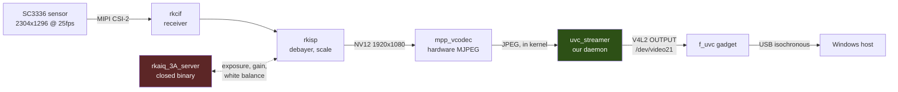

# Architecture

How a £8 Linux board ends up looking like a webcam to Windows, and why each
piece is the way it is. Read this before changing anything in `src/streamer/`.

## The short version



Everything from the sensor to the encoder happens inside the kernel. Our daemon
never touches pixels on the main path — it collects finished JPEGs and hands
them to the USB gadget. That is the only arrangement that reaches 25 fps at
1080p on a single 1.2 GHz Cortex-A7.

## The layers

| Layer | What it does | Where it comes from |
|-------|-------------|--------------------|
| `sc3336` | Sensor driver. Programs the sensor over I²C, exposes it as a V4L2 subdevice. | Rockchip 5.10 kernel fork |
| `rkcif` | MIPI CSI-2 receiver. Raw Bayer into memory. | Rockchip kernel fork |
| `rkisp` | Image signal processor. Debayer, denoise, tone curve, downscale to 1920×1080. Exposes `/dev/video11`. | Rockchip kernel fork |
| `rkaiq_3A_server` | Runs the auto-exposure, auto-white-balance and lens-shading loops, writing decisions back to the sensor and the ISP. | **Closed binary** |
| `mpp_vcodec` | Hardware JPEG/H.264 encoder. | Rockchip out-of-tree module |
| `librockit` | Userspace API (`RK_MPI_*`) that wires ISP output straight into the encoder input. | **Closed binary** |
| `f_uvc` | USB Video Class gadget function. Presents `/dev/video21` to userspace and an isochronous video endpoint to the host. | Rockchip kernel fork |
| `uvc_streamer` | This project. Speaks UVC to the host, drives the encoder, moves buffers. | `src/streamer/` |

Two of those are closed binaries with no source and no public register
documentation for the hardware they drive. That constrains the project more
than anything else — see [Why not bare metal](#why-not-bare-metal).

## Why the encoder is bound in the kernel

The obvious design — capture NV12 from `/dev/video11`, encode it in userspace,
send it — was built first and does not work well enough:

- **Software JPEG** reached about 4–5 fps at 1080p. It saturated the only core,
  which then starved the USB controller's isochronous pump; `dmesg` filled with
  `request not queued to ep2in` and the host assembled torn frames. The encoder
  itself was correct — pixel-exact on synthetic test patterns — and simply far
  too slow for this CPU. It was kept as an automatic fallback for a while and
  has since been removed: a fallback that delivers torn video at a fifth of the
  frame rate is not a degraded camera but a broken one, and having it there made
  faults harder to diagnose rather than easier, because a board with a real
  hardware problem still produced a picture.

- **Direct `librockchip_mpp`** looks like the answer and is a dead end on this
  SoC. The RV1103 ships an encode-only "vcodec service" fork of MPP: the
  userspace `encode_put_frame` / `encode_get_packet` path accepts a frame,
  reports success, and never produces a packet. The channel is created, the
  configuration is applied, and no encode is ever triggered.

What does work is Rockit's **VI→VENC bind**: `RK_MPI_SYS_Bind()` connects the
video input to the video encoder inside the kernel, and frames never enter
userspace at all. `src/streamer/rkmpi_venc.c` sets this up and then only calls
`RK_MPI_VENC_GetStream()` to collect finished JPEGs.

The result is 1920×1080 at 25 fps, around 25 Mbit/s, with no dropped frames and
the CPU almost idle.

> **Consequence worth knowing:** the hardware encoder is 4:2:0 only. NV16 and
> YUYV inputs are either rejected or silently downsampled. This was verified
> with `mpi_enc_test`; it is not a limitation of our code.

## Pipelining encode and transmit

With the hardware path, encode and USB transmission overlap. While one UVC buffer
is in flight to the host, the encoder can fill the next. That pipelining is what
makes 25 fps sustainable; the old software encoder had to serialise the two
steps and could not keep up.

## The pipeline outlives the stream

A host stopping the stream does not tear the pipeline down. `STREAMOFF` pauses
the encoder; the VI and VENC channels stay open, holding their buffers, and the
next `STREAMON` at the same size resumes them. The pipeline is only really
released when the host asks for a different resolution, or after `VENC_IDLE_MS`
(five seconds) with nobody watching.

This is not an optimisation, it is a correctness requirement, and it is worth
knowing why before changing it.

Building the pipeline allocates from CMA — a 24576 kB region, separate from
ordinary memory and reserved at boot. A sustained 2304×1296 stream holds about
11760 kB of it: two NV12 capture buffers at 4374 kB each, plus an encoder output
buffer sized `w*h`. Restarting streams drives the peak to 18336 kB, three
quarters of the region. CMA allocations must be physically contiguous, so what
matters is not how much is free but whether an unbroken run that large is still
there.

Hosts restart streams far more often than you would expect. Media Foundation
restarts three times to take one photograph. Applications reopen the camera when
they change layout. Building and destroying 18 MB of contiguous allocations that
often fragments CMA until a request cannot be satisfied, and the vendor
`mpp_vcodec` module responds to a failed channel create by starting the encoder
on it anyway and oopsing — which kills the daemon while the gadget is bound, and
takes the whole device down. See [the kernel panic you must not
trigger](#the-kernel-panic-you-must-not-trigger); this is the same panic
approached from a different direction.

So the pipeline is kept. Two consequences worth stating plainly:

- The sensor and ISP stay powered for up to five seconds after a host stops.
  That is the price, and `VENC_IDLE_MS` is where it is set.
- Between streams the encoder is stopped but still bound to VI, so it rejects an
  offered frame every 40 ms and the kernel logs `jpeg overflow` each time. It is
  noisy and harmless. Unbinding to silence it does not work — the matching bind
  on resume never returns.

## UVC negotiation, and the bug that hid inside it

A UVC host negotiates format by writing a **probe** control, reading back what
the device is willing to do, then writing a **commit**. The daemon answers these
in `handle_data()` in `src/streamer/uvc_streamer.c`.

The struct has two sizes. UVC 1.1 defines 34 bytes; UVC 1.0 defines 26. The
daemon originally required 34, and **Windows sends 26**. Every commit was
therefore dropped on the floor, silently, and the device streamed its default
1080p no matter what the host asked for.

That failed in a way that took a long time to pin down:

- Media Foundation applications *looked* fine, because MF decodes a JPEG whose
  real dimensions differ from the negotiated ones.
- DirectShow applications — Zoom, e-CamView, OBS's DirectShow path — showed a
  black picture with a ticking frame counter, because quartz's MJPEG
  Decompressor rejects any frame larger than the negotiated size.

The fix is two lines: accept any control of 26 bytes or more, and report 26 from
`UVC_GET_LEN`. All the fields we consume live in the first 26 bytes.

**If you change format negotiation, test on both stacks.** `tools/test/` has a
harness for each: `capture-test.ps1` uses Media Foundation, `dshow-test.ps1`
builds a real DirectShow graph.

### Advertised formats

The gadget descriptors are built at boot by `/etc/init.d/S50usbdevice`. They are
trimmed to **MJPEG only** at four **16:9** resolutions — 640×360, 1280×720,
1920×1080, and 2304×1296 — which is why MJPEG is `bFormatIndex 1`. Removing the
YUYV and H.264 descriptors matters beyond tidiness: uncompressed 1080p does not
fit in the USB 2.0 isochronous budget, and offering it invites hosts to pick it.

2304×1296 is the sensor's native readout; at that size nothing in the path
scales. The other three are ISP downscales of that same full frame. The field of
view is identical at every resolution.

The advertised frame interval is **400000** (25 fps) and nothing else — interval
in 100 ns units is 10000000 / fps. Older descriptors offered 30, 15, 10 and 5
fps, none of which the daemon honoured, so hosts displayed a frame rate they
never received.

To change which resolutions are offered, edit **both** `S50usbdevice` and
`mjpeg_frame_dims()` in `uvc_streamer.c` — the host selects a mode by index,
so the two must describe the same list in the same order. CI runs `tools/test/check-modes.py`
to catch drift between them. See [configuration.md](configuration.md#resolutions).

## Field of view

The lens spans **98.3° diagonally**, which is wider than a typical webcam and
visibly barrel-distorted. You always get the full field at every advertised
resolution — it is not croppable.

Hardware **EPTZ** cropping (`RK_MPI_VI_SetEptz`) and `/oem/uvc.conf` were
removed. Measurement showed the trade was worse than it looked: comparing a
cropped frame against an uncropped one at matched field of view and matched
pixel count, high-frequency detail falls to **0.74×**. The ISP crops *after* the
sensor has been scaled down, so narrowing was a true digital zoom, not a free
trim. It also did not fix barrel distortion — that is a property of the lens,
and cropping only kept the least-bent part of the picture.

Historical note: EPTZ on this platform had awkward behaviour (the crop call was
silently discarded until re-applied from the streaming loop; the rect was
validated against the negotiated channel size; state persisted across sessions).
None of that matters now the feature is gone.

Real geometric correction would be the ISP's **LDCH** block. The hardware and
the `isp32` driver support it, and enabling `aldch` in the IQ file does start the
mesh generator — but no mesh ever reaches the driver (`no ldch buffer allocated`,
every frame) because nothing holds an AIQ context to drive the aldch API: we run
a bare `rkaiq_3A_server` with no `rkipc`. The shipped mesh coefficients also
belong to a different sensor and lens. This is a separate project.

You can confirm the block is inactive on your own board without reading any
code. `/proc/rkisp-vir0` reports the state of every ISP block, and the LDCH line
reads `OFF`:

```bash
adb shell "grep -E 'LDCH|CPROC|HDRDRC|GAIN' /proc/rkisp-vir0"
```

That file is a useful window into the ISP generally — it also reports the white
balance gains in force, the ISP frame counter, and frame loss. See
[measuring.md](measuring.md).

## Startup

```
S21appinit
  └─ /oem/usr/bin/RkLunch.sh
       ├─ post_chk &                 (background: waits for /userdata, loads sensor modules)
       └─ /oem/usr/bin/start_3a.sh & (waits for /dev/video11, then execs rkaiq_3A_server)

S50usbdevice                          builds the USB gadget through configfs
  └─ /oem/uvc_run.sh                  execs /oem/uvc_streamer, logging to /tmp/uvc.log
```

The important subtlety: **`/dev/video11` appears asynchronously.** Sensor modules
load in a background `post_chk &`, so anything that depends on the ISP must wait
for the node rather than assume it. That is what `start_3a.sh` does.

Equally important in the other direction: **the daemon does not need the camera
in order to enumerate.** `rkmpi_venc_start()` runs on demand when a host actually
opens a stream, so the gadget can be up and the camera selectable in an
application while the sensor and 3A are still coming up.

### The gadget will not attach until userspace subscribes

The vendor's `f_uvc.c` sets `bind_deactivated = true`. The entire composite
device stays soft-disconnected until userspace subscribes to `UVC_EVENT_SETUP`
on the UVC node. Nothing enumerates before the daemon starts. This is the single
most confusing failure mode on a fresh board, because the symptom — a device
that draws power and does nothing — looks like broken hardware.

## The kernel panic you must not trigger

**Never `killall uvc_streamer` while the gadget is bound.**

The chain: the daemon exits → the UVC function deactivates → a uevent re-runs
`S50usbdevice` → the UDC is rewritten → the kernel panics in `ffs_func_unbind`.
configfs wedges, a soft reboot hangs, and the board needs a physical power cycle.

The supported way to deploy a new binary is to push it to `/tmp`, `chmod +x` it,
`mv` it over the old one — renaming a running executable is safe — and reboot.

This also decides an open design question: a supervisor that restarts a dead
daemon would take exactly this path, so the honest recovery mechanism for a hung
daemon is a watchdog reboot, not a respawn.

## Budget

| Resource | Reality |
|----------|---------|
| CPU | One Cortex-A7 at 1.2 GHz. No SMP. |
| RAM | 33 MB usable after the kernel and CMA reservations. |
| CMA | 24576 kB, reserved at boot, separate from the above. A 2304×1296 stream holds about 11760 kB of it, contiguously, peaking at 18336 kB across restarts. See [the pipeline outlives the stream](#the-pipeline-outlives-the-stream). |
| rootfs | 67 MB UBI, **96% full**. Anything added has to displace something. |
| `/oem` | 22 MB UBI, where the daemon and vendor libraries live. |
| `/userdata` | 4.5 MB UBI, nearly empty. |
| `/tmp` | 16 MB tmpfs. Large captures get OOM-killed. |

A load average around 6 on an idle board is normal and not a problem: Rockit's
kernel threads (`vlog`, `vsys`, `vrga`, `vpss`, `vrgn`, `vmcu`) sit in
uninterruptible sleep, which Linux counts as load. The CPU is over 80% idle.

## Why not bare metal

It comes up, so it is worth answering directly. Writing dedicated firmware —
no Linux, just a loop that moves frames — is not viable here:

- The ISP is a large fixed-function block with **no public register
  documentation**, and the only software that tunes it is a closed userspace
  binary. Replacing it means reimplementing proprietary 3A algorithms against
  hardware nobody outside Rockchip has documented.
- The same is true of the MIPI receiver and the encoder.
- Mainline Linux is not an escape hatch either: this camera pipeline exists only
  in Rockchip's kernel fork.

What "Linux" costs here is also smaller than it sounds. The system is already
BusyBox in 33 MB — closer to firmware than to a server. The weight is in the
vendor's extra services and in startup sequencing, not in the kernel. So the
realistic path to appliance-like behaviour is **stripping the vendor image**,
which is what [roadmap.md](roadmap.md) plans.

## Files

| Path | Role |
|------|------|
| `src/streamer/uvc_streamer.c` | The daemon: UVC event handling, format negotiation, buffer pumping |
| `src/streamer/rkmpi_venc.c` | Rockit VI→VENC pipeline and hardware MJPEG encode |
| `tools/test/check-modes.py` | CI check that USB descriptor modes match `mjpeg_frame_dims()` |
| `ref/` | Reference sources for reading only — not compiled. `ref/uvc-gadget.c` and `ref/uvc-gadget.h` are from Rockchip; `ref/g_uvc.h` is the Linux kernel UVC gadget userspace API header (GPL-2.0+ WITH Linux-syscall-note, Laurent Pinchart). See [NOTICE](../NOTICE). |
