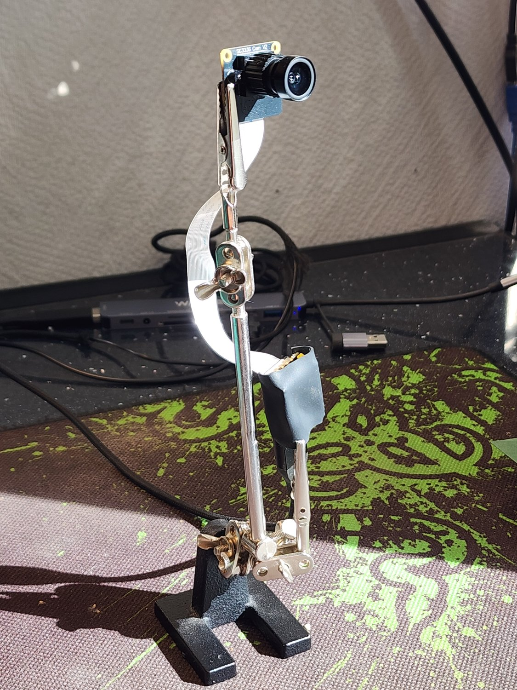

# Hardware

Physical reference for the Luckfox Pico Mini B and SC3336 camera module used in
this project. For how the pieces connect in software, see
[architecture.md](architecture.md). For deploying binaries and board files, see
[installing.md](installing.md).

## Board — Luckfox Pico Mini B

| | |
|---|---|
| SoC | Rockchip RV1103 — single ARM Cortex-A7 at 1.2 GHz, no SMP |
| RAM | 64 MB DDR2 on package; about 33 MB usable by Linux after kernel and CMA |
| Storage | 128 MB SPI NAND, partitioned as UBI volumes: rootfs 67 MB, `/oem` 22 MB, `/userdata` 4.5 MB |
| USB | USB 2.0 Type-C, used for both power and data |
| Recovery | A BOOT button, used to enter maskrom mode — see [recovery.md](recovery.md) |

## Camera — SC3336 module

| | |
|---|---|
| Sensor | 3 MP, MIPI CSI-2, two lanes, connected by FPC ribbon |
| Control | I²C bus 4, address `0x30` |
| Chip ID | Registers `0x3107` / `0x3108` read back `0xcc 0x41` |
| Lens | On the "3MP Camera (B)" module: 3.95 mm f/2.0, **98.3° diagonally** |
| Mode in use | **2304×1296 at 25 fps**, 10-bit Bayer (`SBGGR10`), scaled by the ISP to 1920×1080 |
| Tuning file | `/oem/usr/share/iqfiles/sc3336_CMK-OT2119-PC1_30IRC-F16.json` |

The field-of-view figure and the ISP scaling behaviour are also discussed in
[architecture.md](architecture.md#field-of-view).

## Assembly

- The camera plugs into the MIPI FPC connector. Mind the contact orientation.
  No soldering is required.
- Use a USB-C **data** cable. Power-only cables enumerate nothing — see
  [installing.md](installing.md#connecting-to-the-board).
- A poor cable or an underpowered port can cause instability; prefer a rear
  motherboard port or a powered hub.

<p align="center">
  
</p>

<p align="center"><em>A bench setup during development: the module in the clamp,
the FPC ribbon looping down to the board, which is wrapped against shorts at the
lower jaw. A clamp stand is not required — it just makes the camera easy to aim
while measuring.</em></p>

## Verifying the camera is wired correctly

```bash
adb shell "i2cdetect -y 4"          # the sensor should appear at 0x30
adb shell "lsmod | grep -E 'sc3336|rkcif|rkisp'"
adb shell "dmesg | grep -i sc3336"  # expect a 'Detected' line
```

## Reading sensor registers directly

The SC3336 uses **16-bit register addresses**, which BusyBox's `i2cget` cannot
express — it rejects anything above 255. Use `i2ctransfer` instead: write the
two address bytes, then read:

```bash
# chip ID at 0x3107..0x3108 -> expect 0xcc 0x41
adb shell "i2ctransfer -f -y 4 w2@0x30 0x31 0x07 r2"

# exposure at 0x3e00..0x3e02, a 20-bit value in 1/16-line units
adb shell "i2ctransfer -f -y 4 w2@0x30 0x3e 0x00 r3"

# gain: 0x3e06 coarse digital, 0x3e07 fine digital, 0x3e09 analogue
adb shell "i2ctransfer -f -y 4 w2@0x30 0x3e 0x06 r4"
```

`-f` is needed because the kernel driver owns the device. Reads are
non-destructive.

### Decoding the gain registers

This is worth spelling out, because the obvious reading of these registers is
wrong and gives an answer that looks plausible.

The four bytes are `0x3e06`, `0x3e07`, `0x3e08`, `0x3e09`. Note that **the
analogue gain is `0x3e09`, not the `0x3e08`/`0x3e09` pair** — the driver never
writes `0x3e08`, and it reads back as zero. Note also that the gain codes are
**not a linear scale**: each analogue code is the lower bound of a band one
octave wide, and the fine digital gain interpolates within that band.

| Register | Meaning | Values |
|---|---|---|
| `0x3e06` | Coarse digital gain | `0x00` = 1×, `0x01` = 2×, `0x03` = 4×, `0x07` = 8× |
| `0x3e07` | Fine digital gain | value ÷ 128, so 1.0× to ~2.0× |
| `0x3e09` | Analogue gain | `0x00` = 1×, `0x40` = 1.52×, `0x48` = 3.04×, `0x49` = 6.08×, `0x4B` = 12.16×, `0x4F` = 24.32×, `0x5F` = 48.64× |

```
total gain = analogue × coarse digital × (fine digital ÷ 128)
```

Two checks confirm the table against the vendor driver: the ceiling it produces,
48.64 × 8 × 2 = 778×, is exactly the driver's `SC3336_GAIN_MAX` (`48.64*16*128`);
and the bands join without a gap, since `0x4F` at maximum fine gain gives
24.32 × 255/128 = 48.45×, just below the 48.64× where `0x5F` takes over.

So `0x07 0xa8 0x00 0x5f` is 48.64 × 8 × 1.3125 = **511×**, not the 7.9× you get
by treating the bytes as a linear pair.

`tools/measure/ae-probe.ps1` automates these reads and does this arithmetic,
logging auto-exposure behaviour over time. Because it reads the control loop's
own decisions rather than judging the picture, it works in a completely dark
room — useful when diagnosing exposure faults that take hours to appear.

## Serial console

Optional but valuable when USB is unstable, because kernel messages survive a
USB drop. The debug UART is on `GPIO1_B2` (board TX) and `GPIO1_B3` (board RX).
Baud rate is **115200** on the stock Luckfox image; Rockchip's own images
commonly use 1500000, so if you see garbage, try that. Connect ground.

See [recovery.md](recovery.md) for wiring, terminal setup, and what you can do
from the console.

## What this hardware cannot do

| Limitation | Detail |
|------------|--------|
| No microphone | There is no audio path on this board or in this project |
| Fixed focus | The lens has no focus adjustment |
| USB 2.0 bandwidth only | Uncompressed 1080p does not fit the isochronous budget; see [architecture.md](architecture.md#advertised-formats) |
| One CPU core | Single Cortex-A7 at 1.2 GHz, no SMP — see [architecture.md](architecture.md#budget) |
